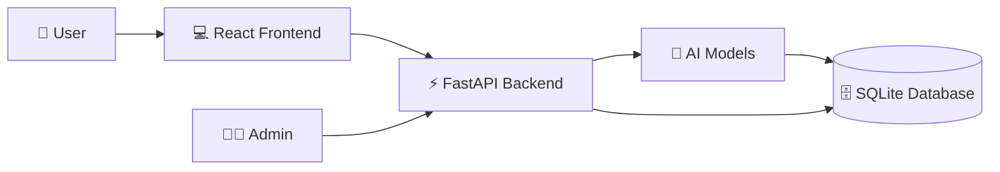
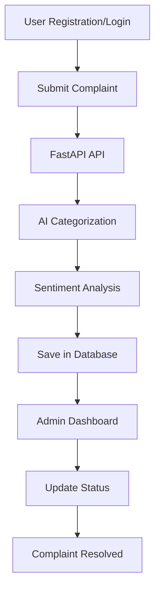
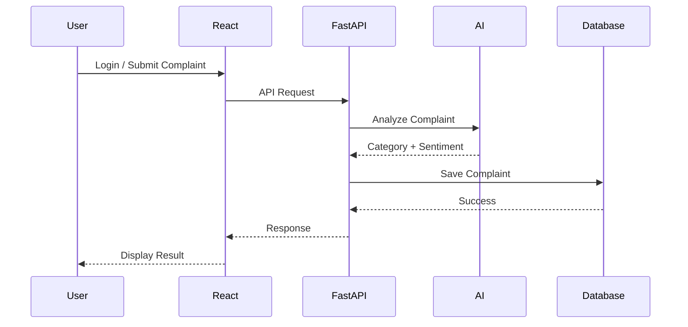
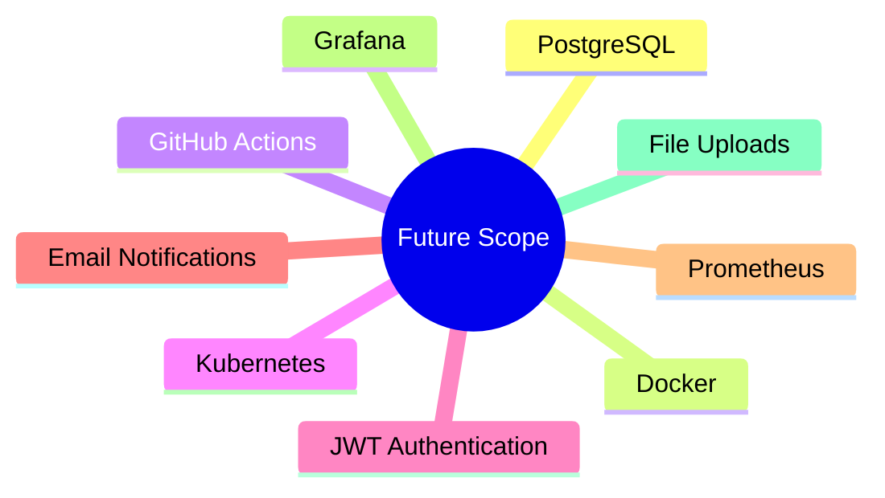

<div align="center">

# 🤖 AI Complaint Management System

An AI-powered Complaint Management System built using **React.js**, **FastAPI**, **SQLite**, and **Hugging Face Transformers**.

Users can register, log in, submit complaints, while AI automatically classifies complaints and analyzes sentiment. Admins can manage complaints and update their status.


</div>

---

# 📌 Overview

This project is designed to simplify complaint management using Artificial Intelligence.

Instead of manually categorizing complaints, the system automatically:

- 📂 Classifies the complaint
- 😊 Detects user sentiment
- ⚡ Assigns priority
- 📊 Allows admins to monitor and resolve complaints

---

# 🏗️ System Architecture



---

# 🔄 Project Workflow



---

# 🚀 Features

### 👤 User

- Register
- Login
- Submit Complaint
- Track Complaint Status

### 👨‍💼 Admin

- Secure Login
- View All Complaints
- Update Complaint Status
- Complaint Dashboard

### 🤖 AI

- Automatic Complaint Categorization
- Sentiment Analysis
- Priority Detection

---

# ⚙️ Tech Stack

| Category | Technology |
|----------|------------|
| Frontend | React.js, JavaScript, HTML, CSS, Bootstrap, Vite |
| Backend | Python, FastAPI |
| Database | SQLite |
| AI | Hugging Face Transformers |
| Server | Uvicorn |
| ORM | SQLAlchemy |

---

# 📂 Folder Structure

```text
AI-Complaint-System
│
├── backend
│   ├── main.py
│   ├── database.py
│   ├── models.py
│   ├── requirements.txt
│   ├── routes/
│   └── ...
│
├── frontend
│   ├── src/
│   ├── public/
│   ├── package.json
│   ├── vite.config.js
│   └── ...
│
├── .gitignore
└── README.md
```

---

# 🚀 Installation

## 1️⃣ Clone Repository

```bash
git clone https://github.com/YOUR_USERNAME/ai-complaint-system.git

cd ai-complaint-system
```

---

# ⚡ Backend Setup

Move into backend folder

```bash
cd backend
```

## Create Virtual Environment

### Linux/macOS

```bash
python3 -m venv venv

source venv/bin/activate
```

### Windows

```bash
python -m venv venv

venv\Scripts\activate
```

---

## Install Dependencies

```bash
pip install -r requirements.txt
```

---

## Run Backend

```bash
uvicorn main:app --reload
```

Backend URL

```
http://127.0.0.1:8000
```

Swagger Documentation

```
http://127.0.0.1:8000/docs
```

---

# 💻 Frontend Setup

Open another terminal

```bash
cd frontend
```

Install packages

```bash
npm install
```

Run application

```bash
npm run dev
```

Frontend URL

```
http://localhost:5173
```

---

# 🔗 API Connection

Inside frontend use

```javascript
const API = "http://127.0.0.1:8000";
```

or

```javascript
const API = "http://localhost:8000";
```

---

# 🌐 Enable CORS

```python
from fastapi.middleware.cors import CORSMiddleware

app.add_middleware(
    CORSMiddleware,
    allow_origins=["http://localhost:5173"],
    allow_credentials=True,
    allow_methods=["*"],
    allow_headers=["*"],
)
```

---

# 🤖 AI Models

## 1️⃣ Zero-Shot Classification

Automatically predicts complaint category.

Example

Input

```
Electricity issue in Hostel 4
```

Output

```
Category → Electricity
```

---

## 2️⃣ Sentiment Analysis

Detects complaint sentiment.

Example

Input

```
The electricity service is very poor.
```

Output

```
Negative
```

---

# 📡 REST APIs

| Method | Endpoint | Description |
|---------|----------|-------------|
| POST | `/register` | Register User |
| POST | `/login` | User Login |
| POST | `/complaints` | Submit Complaint |
| GET | `/complaints` | Fetch Complaints |
| PUT | `/complaints/{id}` | Update Status |

---

# 🗄 Database

SQLite stores:

### Users

```
id
username
password
role
```

### Complaints

```
id
text
category
sentiment
priority
status
username
```

---

# 📈 Application Flow



---

# 📸 Screenshots

Create an **images** folder and place screenshots inside.

```
images/
│
├── login.png
├── register.png
├── dashboard.png
├── admin.png
└── complaint.png
```

Then uncomment and use:

```markdown
## Login


## Register


## Dashboard


## Admin


## Complaint


```

---

# 🚀 Deployment

## Frontend

Deploy on **Vercel**

```bash
npm run build
```

Output folder

```
dist/
```

---

## Backend

Deploy on **Render**

Build Command

```bash
pip install -r requirements.txt
```

Start Command

```bash
uvicorn main:app --host 0.0.0.0 --port $PORT
```

---

# ⚠️ Known Issues

- SQLite is suitable for development only.
- Use PostgreSQL for production.
- First AI model load may take a little time.
- Configure CORS correctly before deployment.

---

# 📈 Future Improvements



---

# 🌟 Future Scope

- PostgreSQL
- Docker
- GitHub Actions (CI/CD)
- Kubernetes
- JWT Authentication
- Email Notifications
- Monitoring
- File Upload Support

---

# 👨‍💻 Author

**Vivek**

GitHub:

```
https://github.com/YOUR_USERNAME
```

---

# 📄 License

This project is intended for educational and learning purposes.

---

<div align="center">

⭐ If you found this project useful, consider giving it a star!

</div>
